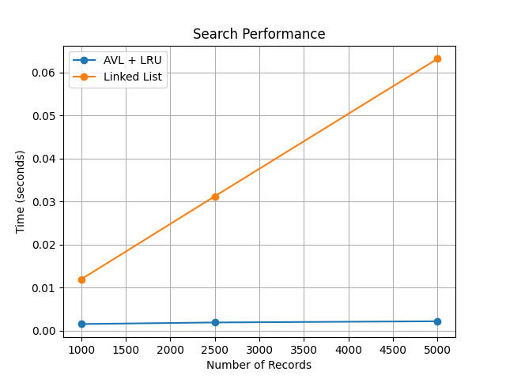
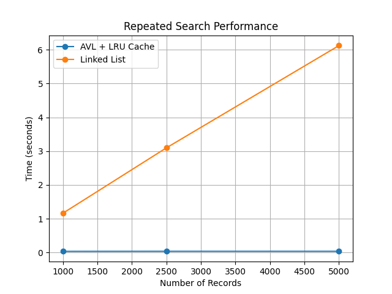

# MiniDB – ACID-Compliant AVL Tree Database

## Overview

MiniDB is a lightweight database management system written in Python. It combines an **AVL Tree** indexing engine with an **LRU Cache** to provide efficient record storage and retrieval while supporting persistent storage and core ACID database properties.

The project demonstrates how modern database concepts—including indexing, caching, persistence, transactions, and concurrency control—can be implemented from scratch without relying on external database libraries.

---

## Features

- Create and manage multiple tables
- Insert, select, update, and delete records
- AVL Tree indexing for balanced O(log n) operations
- LRU Cache for O(1) repeated lookups
- Persistent JSON-based storage
- Automatic database loading on startup
- Transaction support
  - Begin transaction
  - Commit
  - Rollback
- Thread-safe operations using re-entrant locks
- Atomic disk writes using temporary files and file replacement
- Command-line interface

---

## ACID Properties

MiniDB implements the core ACID database principles:

### Atomicity

Transactions are executed as a single unit of work.

- Database state is snapshotted before a transaction begins
- Failed commits automatically restore the previous state
- Rollback restores both database contents and cache

### Consistency

- Duplicate primary keys are prevented
- AVL Tree balancing preserves indexing correctness
- Persistent storage always reflects a valid database state

### Isolation

Thread-safe execution is achieved using Python's `threading.RLock()`.

- Only one write transaction may modify the database at a time
- Concurrent operations cannot partially observe in-progress writes

### Durability

Committed transactions are permanently stored using JSON persistence.

To prevent database corruption during crashes:

- Data is first written to a temporary file
- The file is flushed to disk using `fsync()`
- `os.replace()` atomically replaces the previous database file

---

## Storage Engine

MiniDB stores all records inside `database.json`.

When the database starts:

1. The JSON file is loaded.
2. Tables are recreated.
3. Records are reinserted into their AVL Trees.
4. The database is immediately ready for querying.

No manual loading is required.

---

## Indexing

Each table is implemented as an AVL Tree.

Benefits:

- O(log n) insertion
- O(log n) lookup
- O(log n) deletion
- Automatically balanced after updates

---

## Cache

MiniDB includes an LRU (Least Recently Used) cache.

Implementation:

- Hash map
- Doubly linked list

Complexities:

- O(1) lookup
- O(1) insertion
- O(1) eviction

Repeated queries are served directly from cache without traversing the AVL Tree.

---

## Project Structure

```
MiniDB/
├── main.py          # CLI interface
├── Database.py      # Database engine
├── AVL.py           # AVL Tree implementation
├── LRU.py           # LRU Cache
├── storage.py       # Persistent JSON storage
├── benchmark.py     # Performance benchmarking
└── database.json    # Stored database
```

---

## Performance

MiniDB was benchmarked against an equivalent database implementation using a linked list for indexing.

### Search Performance

Search operations remained consistently fast as the dataset grew, demonstrating the logarithmic lookup performance of the AVL tree.



**Benchmark Results**

| Records | MiniDB (AVL + LRU) | Linked List | Improvement |
|---------:|-------------------:|------------:|------------:|
| 1,000 | 0.001514 s | 0.011904 s | **87.3% faster** |
| 2,500 | 0.001883 s | 0.031203 s | **94.0% faster** |
| 5,000 | 0.002163 s | 0.063173 s | **96.6% faster** |

---

### Repeated Search Performance

Frequently accessed records benefit from the LRU cache, allowing repeated lookups to avoid traversing the AVL tree entirely.



**Benchmark Results**

| Records | MiniDB (AVL + LRU Cache) | Linked List | Improvement |
|---------:|-------------------------:|------------:|------------:|
| 1,000 | 0.035264 s | 1.162153 s | **97.0% faster** |
| 2,500 | 0.037352 s | 3.096912 s | **98.8% faster** |
| 5,000 | 0.037363 s | 6.123037 s | **99.4% faster** |

---

These benchmarks demonstrate the effectiveness of combining AVL tree indexing with an LRU cache. AVL trees maintain efficient O(log n) search performance as the dataset grows, while the LRU cache provides near-constant-time access for frequently queried records, significantly reducing repeated lookup times.

---

## Commands

### Create Table

```
CREATE TABLE <table_name>
```

### Insert

```
INSERT <table> <id> <first> <last> <age> <semester> <wam> <grade>
```

### Select

```
SELECT <table> <id>
```

### Update

```
UPDATE <table> <id> <first> <last> <age> <semester> <wam> <grade>
```

### Delete

```
DELETE <table> <id>
```

### Show Tables

```
SHOW TABLES
```

### Show Table

```
SHOW TABLE <table_name>
```

### Help

```
HELP
```

### Exit

```
EXIT
```

---

## How to Run

```bash
python main.py
```

---

## Technologies

- Python
- AVL Trees
- Doubly Linked Lists
- Hash Maps
- JSON Persistence
- Threading (RLock)
- File Synchronisation (`fsync`)
- Atomic File Replacement (`os.replace`)

---

## Summary

MiniDB demonstrates the implementation of a lightweight database system from first principles, including:

- AVL Tree indexing
- LRU caching
- Persistent storage
- Transaction management
- ACID properties
- Thread-safe concurrency control
- Performance benchmarking